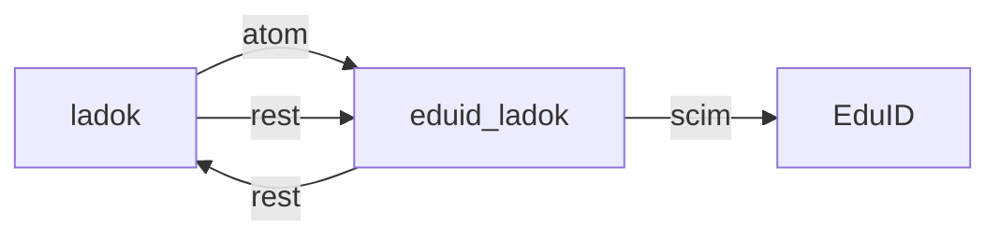

# eduid_ladok
Integration between eduid and ladok

## Build
```
# Linux
make build-static
```

## Flow

```mermaid
graph LR
    ladok -->|atom| eduid_ladok
    ladok -->|rest| eduid_ladok
    eduid_ladok -->|rest| ladok

    eduid_ladok --> |scim|EduID
```     